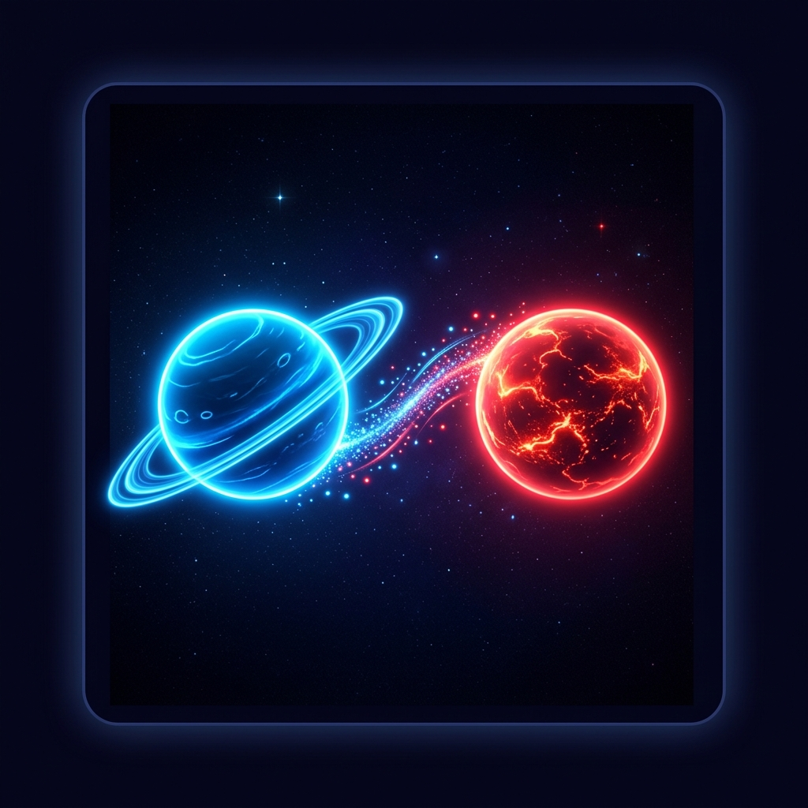

# 🪐 Planetary Conquest PWA

Una recreación minimalista y elegante de **Auralux** construida como una Progressive Web App (PWA). Conquista la galaxia capturando núcleos planetarios en una batalla estratégica de tiempo real.

## ✨ Características Premium
- **Estética Neon Space:** Diseño visual de alta fidelidad con efectos de brillo, glassmorphism y animaciones fluidas.
- **Rendimiento Optimizada:** Motor de juego basado en HTML5 Canvas (60 FPS).
- **PWA Ready:** Instalable en dispositivos iOS/Android y escritorio. Funciona sin conexión.
- **Interfaz Intuitiva:** Soporte completo para Mouse y Touch (Arrastrar para atacar).

## 🚀 Cómo instalar en tu teléfono (Mobile-First)

Para que el juego sea una App real en tu teléfono, sigue este flujo exacto:

### 1. Subir el código con GitHub Desktop
1. Abre **GitHub Desktop**.
2. Añade este proyecto (`File -> Add Local Repository`).
3. Haz **Commit** y presiona **Publish Repository**.
4. Súbelo a tu cuenta de GitHub.

### 2. Activar GitHub Pages (El Servidor)
1. Ve a tu repositorio en la web de GitHub.
2. Ve a `Settings -> Pages`.
3. Selecciona la rama `main` y guarda (`Save`).
4. Espera 1-2 minutos hasta que aparezca el mensaje: *"Your site is live at..."*.

### 3. Instalar en el teléfono
1. Copia esa URL (ej: `https://usuario.github.io/planetas/`) y ábrela en **Chrome** (Android) o **Safari** (iOS).
2. **En Android:** Toca los tres puntos y elige **"Instalar aplicación"** o **"Añadir a pantalla de inicio"**.
3. **En iOS:** Toca el icono de compartir (flecha hacia arriba) y elige **"Añadir a pantalla de inicio"**.
4. ¡Listo! Ahora tienes el juego como una App nativa en tu móvil.

## 🎮 Cómo Jugar
- **Objetivo:** Conquistar todos los planetas eliminando la presencia de la IA.
- **Producción:** Los planetas que controlas generan unidades automáticamente. Los planetas más grandes producen unidades más rápido.
- **Ataque/Refuerzo:** Haz clic (o toca) un planeta que controles y **arrastra** hacia otro planeta para enviar el 50% de tus unidades acumuladas.
- **Captura:** Si tus unidades superan la defensa de un planeta enemigo o neutral, este pasará a ser de tu color.

## 🛠️ Tecnologías
- **Core:** Vanila JavaScript (ES6+).
- **Styles:** CSS Moderno (Variables, Glassmorphism).
- **PWA:** Manifest.json, Service Workers.
- **Graphics:** HTML Canvas API.

---
*Desarrollado con ❤️ por Antigravity.*
